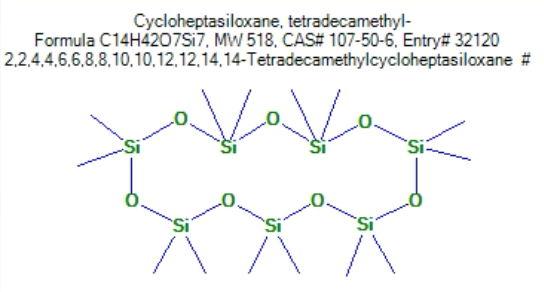

# Summary
For those compounds observed in F1, the silver ion column resulted in an order-of-magnitude decrease in TIC. F1 was greatly depleted in hydroxy-bearing FAMES.

No compounds eluted in F2, which targets cis monoenes, trans/trans dienes, and CLAs. All monoenes eluted in F1.

None of the compounds expected in F3 eluted (dienes). Oddly, one compound eluted in F3 of the discovery column, FAME C16:0, which would be expected to elute in F1.

Silocone signal was observed across all samples. Silicone peaks coeluted with FAMEs 3-OH 14:0 (28 minutes) 17:0 (31 minutes), and 20:0 (36 minutes). My guess is that this is a product of the column production/cleaning.

```{r, echo = FALSE}

```

# Protocol
A BAMES standard was run through two silver ion (Ag) columns to test the efficacy/cleanliness of the columns. A **Supelco Ag-Ion Discovery** column "Disc" and a homemade **Silver Nitrate** "Nitr" column were both tested (protocol courtesy of Nicolo Ardenghi).

`TC-BAME2` was taken from OGL Center Mini -20˚C. 245µg of total lipid BAME was suspended in 245µL of hex.
10µL (10µg) was removed and combined with 250µL hexane. The entirey of this stock **(10µg)** was applied to the Ag column.

### Discovery Ag-Ion Column Chromatography
0. Set up Ag-Ion columns over waste colleciton vials.
1. Condition SPE with 4mL acetone
2. Equilibrate cartridge with 4mL hexane. 
3. Load FAMEs in hexane derived from sample extraction at a flow rate of 2-3 drops/second. Remove waste collection vials and replace with fraction 1 (F1) collection vials (40mL glass vials).
4. Elute F1 with 6mL hexane:acetone 96:4
*Fraction 1 targets saturated FAs, trans monoenes, cis/cis and trans/trans conjugated linoleic acids*
5. Elute F2 with 4mL hexane:acetone 90:10
*Fraction 2 will target: cis monoenes, trans/trans dienes, CLAs*
6. Elute F3 with 4mL acetone
*Fraction 3 targets cis/cis dienes, other dienes, trienes.*
7. Evaporate all fractions at 40˚C under N2, sparge.
8. Reconstituted in three 100µL hexane washes, added to a GC vial with insert.
8. Evaporated at 40˚C under N2, reconstituted in 50µL cyclohexane for GC analysis.

**GC-MS**

- Instrument method: `OG_DB-1_F9_longMethod_fullscan_300Csource_cyclohexane_FAMES`
- Processing Method: `BAMES STANDARD`

```
Autosampler Position: Sample
37: Cyclohex Blank
38: TC-BAMES-2
39: BAMES F1 Disc
40: BAMES F2 Disc
41: BAMES F3 Disc
42: BAMES F1 Nitr
43: BAMES F2 Nitr
37: Cyclohex Blank
```

NOTE: F3 of Ag-Nitrate was disqualified due to the presence of Ag-nitrate powder in the sample collection vial.


# Data

```{r, include = FALSE}
# Libraries
library(tidyverse)
library(plotly)

# Source
source(file.path("libs", "visualization.R"))
source(file.path("libs", "chromleon.R"))
```

## Data Import
```{r}
# Define the root directory and the path names for each file
root <- "data"
path_names = c("2020.12.09_TC_BAMES_Agion/2020.12.09_TC_BAMES_Agion_DB1/TSQ7517_TCBAMES_2_5ug_ul.xls",
          "2020.12.09_TC_BAMES_Agion/2020.12.09_TC_BAMES_Agion_DB1/TSQ7518_BAMES_F1_Disc.xls",
          "2020.12.09_TC_BAMES_Agion/2020.12.09_TC_BAMES_Agion_DB1/TSQ7519_BAMES_F2_Disc.xls",
          "2020.12.09_TC_BAMES_Agion/2020.12.09_TC_BAMES_Agion_DB1/TSQ7520_BAMES_F3_Disc.xls",
          "2020.12.09_TC_BAMES_Agion/2020.12.09_TC_BAMES_Agion_DB1/TSQ7521_BAMES_F1_Nitr.xls",
          "2020.12.09_TC_BAMES_Agion/2020.12.09_TC_BAMES_Agion_DB1/TSQ7522_BAMES_F2_Nitr.xls")
# Define the sample names
sample_names = c("tc_bames2", "bames_disc_f1", "bames_disc_f2", "bames_disc_f3", "bames_nitr_f1", "bames_nitr_f2")

# read_chromeleon_export is a sourced R function. See above.
all_data <-
  tibble(
    sample = sample_names,
    file = path_names,
    data = map(file.path(root, file), read_chromeleon_export),
    injection_details = map(data, "injection_details"),
    integration_results = map(data, "integration_results")
  ) %>% select(-data)

```

## Data Cleanup
``` {r}
results <- all_data %>% 
  select(-injection_details) %>% 
  unnest(integration_results) %>% 
  filter(nchar(`Peak Name`) > 0) %>% 
  # major compound groups
  mutate(
    group = `Peak Name` %>% str_remove("\\d+-OH") %>% parse_number() %>% abs() %>% {paste0("C", .)} %>% factor()
  ) 
```


#Plots
Plots generated using `ggplot2` and `plotly`.

## Overview Plot
```{r, echo = FALSE, warning=FALSE}
factored_samples <- c('tc_bames2','bames_disc_f1','bames_disc_f2','bames_disc_f3', 'bames_nitr_f1', 'bames_nitr_f2', 'bames_nitr_f3')
results$sample_f = factor(results$sample, levels=factored_samples)

plot_results <- results %>% 
  filter(sample %in% c('tc_bames2', 'bames_disc_f1', 'bames_disc_f3', 'bames_nitr_f1'))

p_tc_bames2 <- plot_results %>%
  ggplot() +
  aes(`Retention Time`, `Relative Height`, fill = `Peak Name`) +
  geom_bar(stat = 'identity', width = 0.1)+
  facet_wrap(~sample_f, ncol = 1, scales = "free_y") +
  scale_fill_viridis_d() +
  ggtitle("BAMES Standard 10µg/µL") +
  theme_bw()

p_tc_bames2 %>% ggplotly(dynamicTicks = TRUE)

```

## Individual Plots

```{r, echo = FALSE, warning=FALSE}
p_tc_bames2 <- results %>%
  filter(sample == c("tc_bames2")) %>% 
  ggplot() +
  aes(`Retention Time`, `Relative Height`, fill = `Peak Name`) +
  geom_bar(stat = 'identity', width = 0.1)+
  scale_fill_viridis_d() +
  ggtitle("BAMES Standard 10µg/µL") +
  theme_bw()

p_tc_bames2 %>% ggplotly(dynamicTicks = TRUE)
```
```{r, echo = FALSE, warning=FALSE}
p_bames_disc_f1 <- results %>%
  filter(sample == c("bames_disc_f1")) %>% 
  ggplot() +
  aes(`Retention Time`, `Relative Height`, fill = `Peak Name`) +
  geom_bar(stat = 'identity', width = 0.1)+
  scale_fill_viridis_d() +
  labs(title = "BAMES Discovery Ag-Ion F1", subtitle = "saturated FAs, trans monoenes, cis/cis and trans/trans conjugated linoleic acids") +
  theme_bw()

p_bames_disc_f1 %>% ggplotly(dynamicTicks = TRUE)
```
```{r, echo = FALSE, warning=FALSE}
p_bames_disc_f2 <- results %>%
  filter(sample == c("bames_disc_f2")) %>% 
  ggplot() +
  aes(`Retention Time`, `Relative Height`, fill = `Peak Name`) +
  geom_bar(stat = 'identity', width = 0.1)+
  scale_fill_viridis_d() +
  labs(title = "BAMES Discovery Ag-Ion F2", subtitle = "cis monoenes, trans/trans dienes, CLAs") +
  theme_bw()

p_bames_disc_f2 %>% ggplotly(dynamicTicks = TRUE)
```

```{r, echo = FALSE, warning=FALSE}
p_bames_disc_f3 <- results %>%
  filter(sample == c("bames_disc_f3")) %>% 
  ggplot() +
  aes(`Retention Time`, `Relative Height`, fill = `Peak Name`) +
  geom_bar(stat = 'identity', width = 0.1)+
  scale_fill_viridis_d() +
  labs(title = "BAMES Discovery Ag-Ion F3", subtitle = "cis/cis dienes, other dienes, trienes.") +
  theme_bw()

p_bames_disc_f3 %>% ggplotly(dynamicTicks = TRUE)
```
```{r, echo = FALSE, warning=FALSE}
p_bames_nitr_f1 <- results %>%
  filter(sample == c("bames_nitr_f1")) %>% 
  ggplot() +
  aes(`Retention Time`, `Relative Height`, fill = `Peak Name`) +
  geom_bar(stat = 'identity', width = 0.1)+
  scale_fill_viridis_d() +
  labs(title = "BAMES Ag - Nitrate F1") +
  theme_bw()

p_bames_nitr_f1 %>% ggplotly(dynamicTicks = TRUE)
```

```{r, echo = FALSE, warning=FALSE}
p_bames_nitr_f2 <- results %>%
  filter(sample == c("bames_nitr_f2")) %>% 
  ggplot() +
  aes(`Retention Time`, `Relative Height`, fill = `Peak Name`) +
  geom_bar(stat = 'identity', width = 0.1)+
  scale_fill_viridis_d() +
  labs(title = "BAMES Ag - Nitrate F2") +
  theme_bw()

p_bames_nitr_f2 %>% ggplotly(dynamicTicks = TRUE)
```

